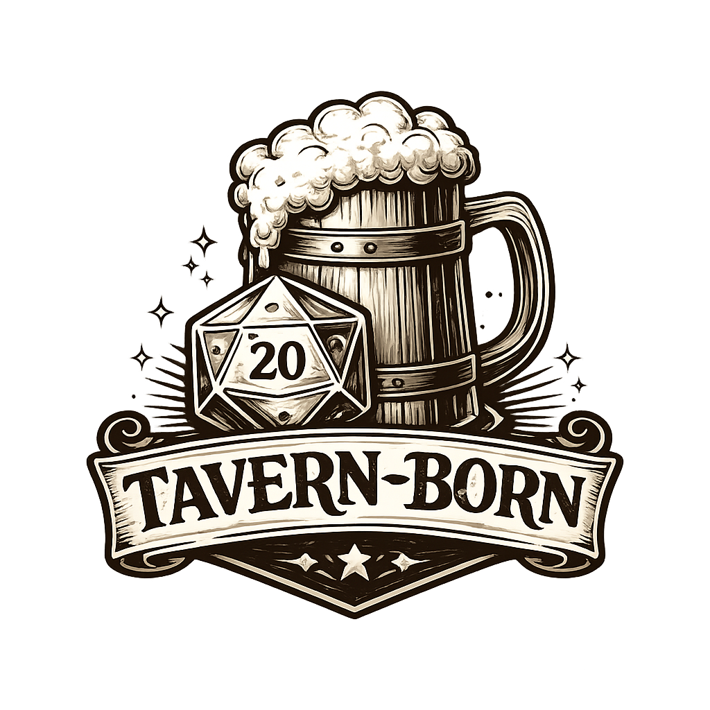
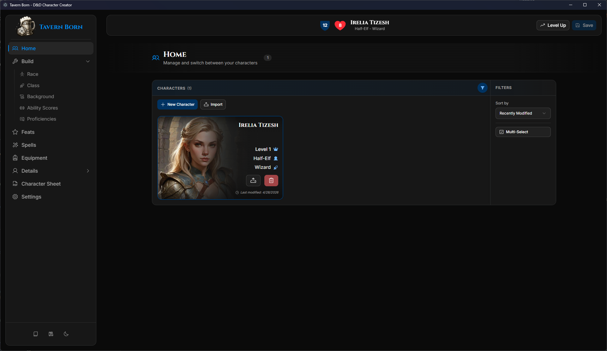
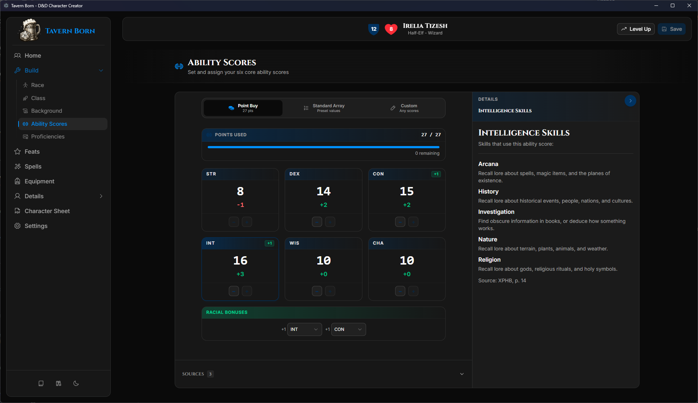
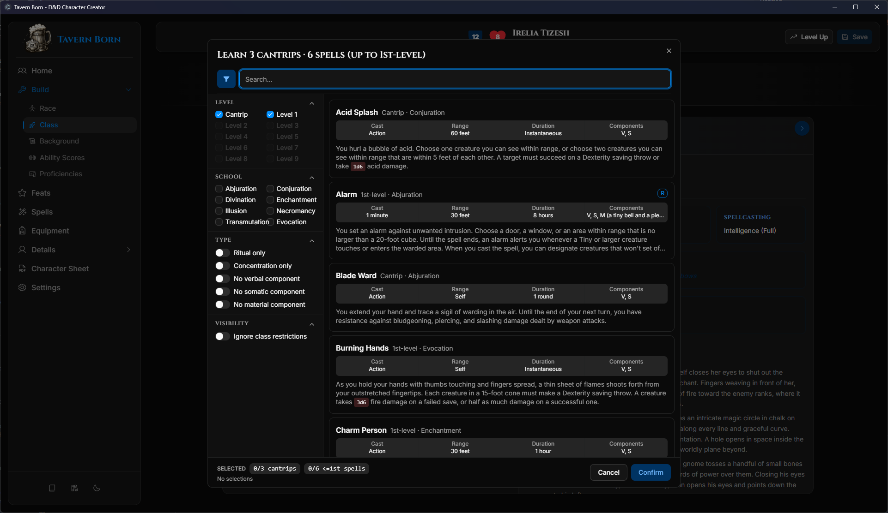
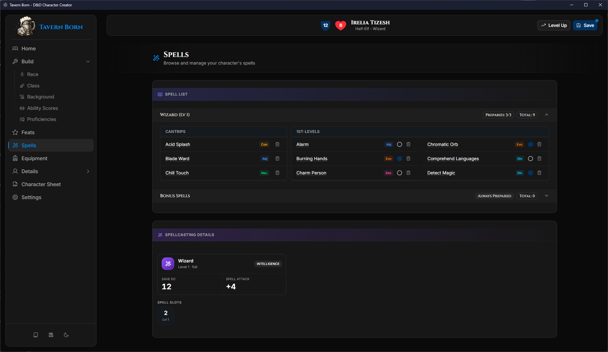
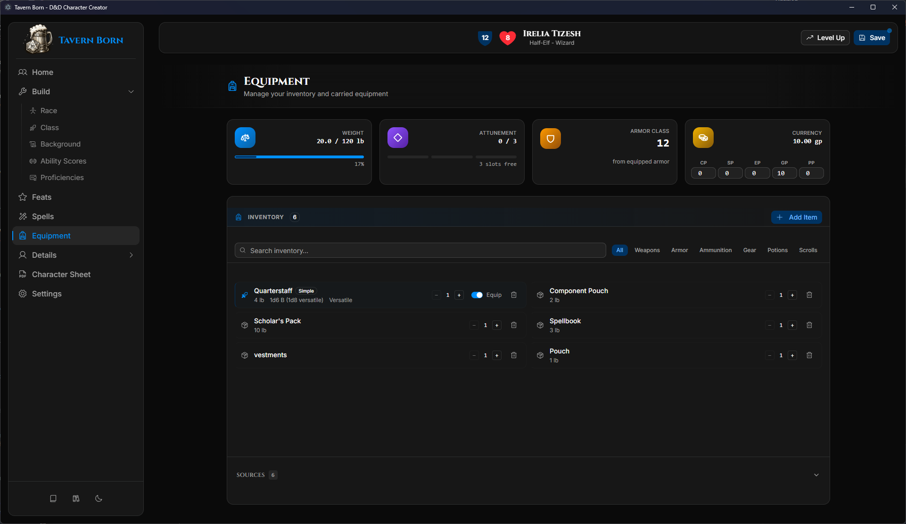
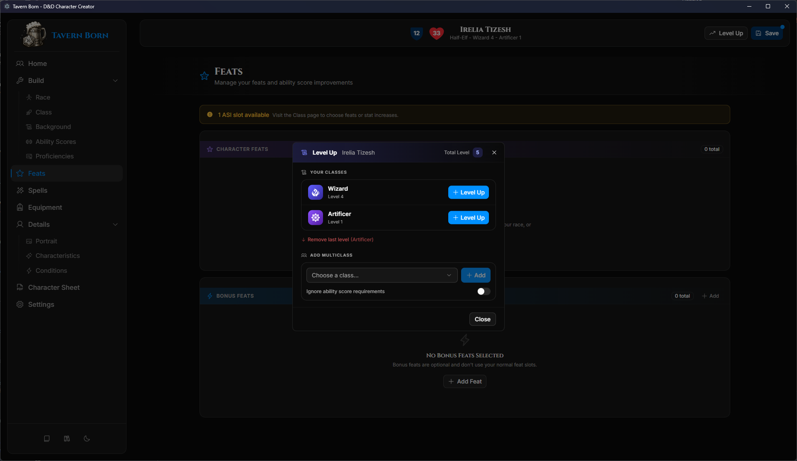

# Tavern Born

<div align="center">



**A comprehensive Dungeons & Dragons 5th Edition character creator**

[](https://www.electronjs.org/)
[](https://tailwindcss.com/)
[](LICENSE)
[](https://wiki.tercept.net/en/home)

</div>

## ✨ Features

- **Step-by-step character creation** — Race, class, background, and ability scores with source filtering
- **Level-up wizard** — Multiclassing, ASI/feat selection, and automatic feature detection
- **Spell management** — Class spell lists, preparation, and multiclass slot calculation
- **Equipment & inventory** — Item management with encumbrance tracking
- **Multiple ability score methods** — Point Buy, Standard Array, Rolling, or Manual Entry
- **Character details** — Portraits, backstory, and physical characteristics
- **PDF export** — Generate a printable character sheet as a PDF

## 📸 Screenshots

<details>
<summary>🏠 Home</summary>


*Browse and manage your characters*

</details>

<details>
<summary>🎲 Ability Scores</summary>


*Set ability scores using Point Buy, Standard Array, Rolling, or Manual Entry*

</details>

<details>
<summary>📖 Spell Selection</summary>


*Browse and select spells with full descriptions and filters*

</details>

<details>
<summary>✨ Spell List</summary>


*Manage prepared spells, cantrips, and view spellcasting details*

</details>

<details>
<summary>⚔️ Equipment</summary>


*Track inventory, weight, attunement slots, armor class, and currency*

</details>

<details>
<summary>⬆️ Level Up & Multiclassing</summary>


*Level up, multiclass, and select ASIs or feats*

</details>

## 🚀 Getting Started

### Option 1: Download Release (Recommended)

1. Download the latest `.exe` from the [Releases](../../releases) page
2. Run the executable

### Option 2: Build from Source

**Prerequisites:** [Node.js](https://nodejs.org/) (LTS recommended)

```bash
git clone https://github.com/kevinkickback/Tavern-Born.git
cd Tavern-Born
npm install
npm run dev
```

## 📊 Game Data

> **⚠️ Important:** Tavern-Born does **NOT** include Dungeons & Dragons game data.

You must provide your own compatible data JSON files. The [5etools Wiki](https://wiki.tercept.net/en/home) (see: Download the Source code) might be helpful.


## 📄 License

This project is licensed under the GNU General Public License v3.0 - see the [LICENSE](LICENSE) file for details.
